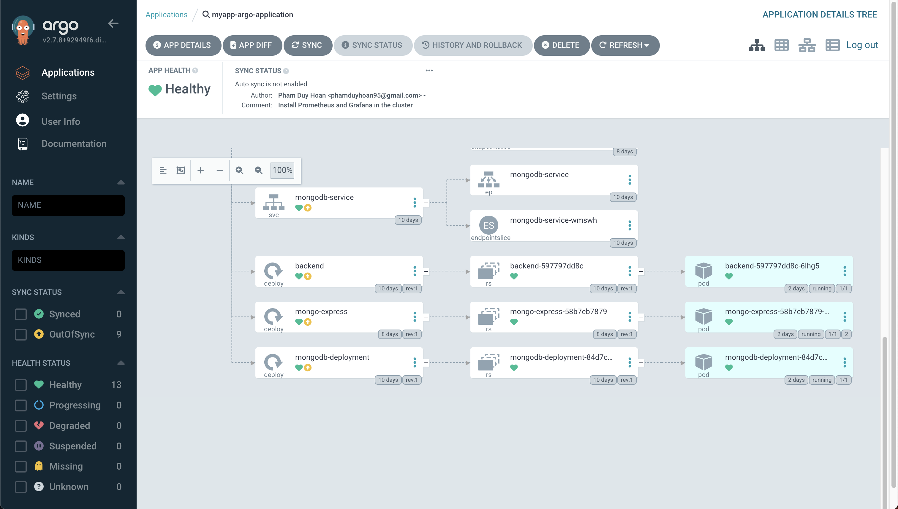

# Install Argocd
https://argo-cd.readthedocs.io/en/stable/
```bash
kubectl create namespace argocd
kubectl apply -n argocd -f https://raw.githubusercontent.com/argoproj/argo-cd/stable/manifests/install.yaml
kubectl patch svc argocd-server -n argocd -p '{"spec": {"type": "LoadBalancer"}}'
kubectl port-forward svc/argocd-server -n argocd 8080:443
```
ArgoCd is accessible via load balancer via the url at
```bash
kubectl get services -n argocd | grep argocd-server
```
The password for the "admin" username:
```bash
kubectl -n argocd get secret argocd-initial-admin-secret -o jsonpath="{.data.password}" | base64 -d
```
### Import ../argocd/argocd-app.yaml when creating the application

Result:
