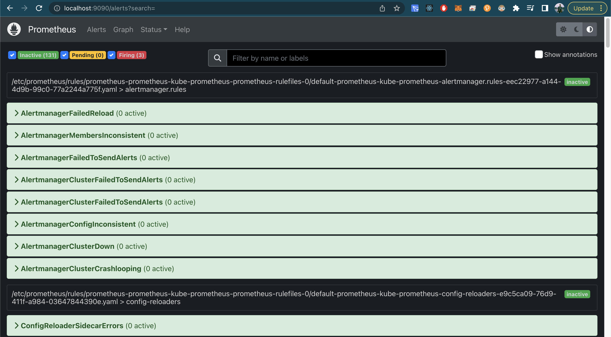
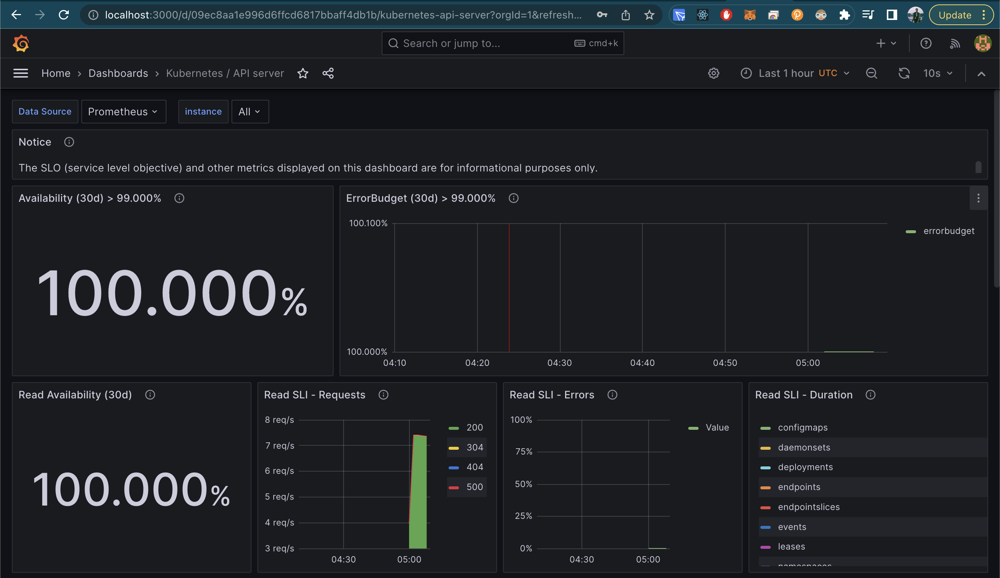
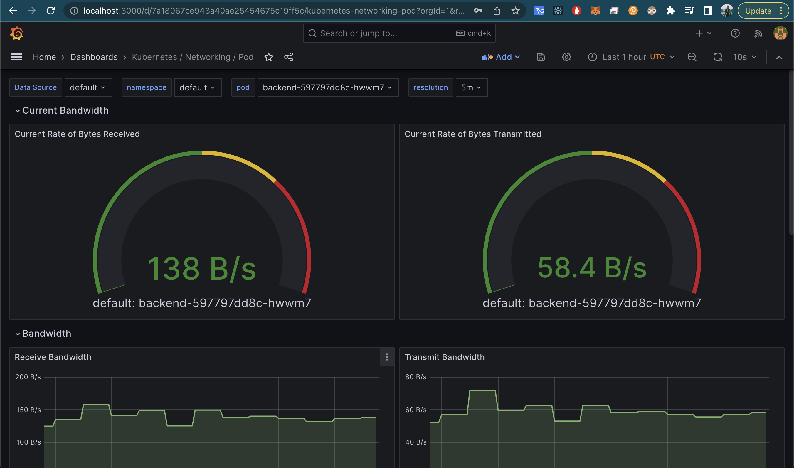

# Create EKS Cluster
```bash
cd eks/
eksctl create cluster   --name mern-devops-v3   --node-type t3.large   --nodes 1   --nodes-min 1   --nodes-max 1   --region ap-southeast-1
aws eks --region ap-southeast-1 update-kubeconfig --name mern-devops-v3
```
# Create Mongo Secrete
``` bash
export mongo_root_username="admin"
export mongo_root_password="password"
# export mongo_uri="mongodb+srv://<your uri>" #FOR MONGO ATLAS VERSION
# export mongo_uri="mongodb://10.100.103.221:27017" # FOR MONGO Local IN THE K8S Cluster

kubectl create secret generic mongodb-secret --from-literal=mongo-root-username=$mongo_root_username --from-literal=mongo-root-password=$mongo_root_password 

kubectl apply -f mongo.yaml
kubectl apply -f mongo-configmap.yaml
kubectl apply -f mongo-express.yaml
```
### How to view mongo-express
```bash
kubectl get pods | grep mongo-express
kubectl port-forward <mongo-express-port-id> 8081
```
Now, you can view the mongo-express in http://localhost:8081

## Update the ip address: database_url in the mongo-configmap.yaml:
``` bash
kubectl get services | grep "mongodb-service"
```
```yaml
  database_url: "172.20.123.1" #TODO: Update here
  mongo-uri: "mongodb://172.20.123.1:27017"
```
## Create Route 53 domain
## Create SSL Certificate in AWS ACM with the according domain (or record A like: api.example.com)
## Copy the ARN's of created ACM to backend-service-loadbalancer.yaml
```
service.beta.kubernetes.io/aws-load-balancer-ssl-cert
```
```bash
kubectl apply -f backend-deployment.yaml
kubectl apply -f backend-service-nodeport.yaml
sed -i 's|<fill your ACM arn here>|<your-real-acm-arn>|g' backend-service-loadbalancer.yaml
kubectl apply -f backend-service-loadbalancer.yaml
```
## Check the Backend Load Balancer we've created
```bash
kubectl get services
```
## Go to Route 53 Domain, create an A record alias to the loadbalancer we've created


# Add Prometheus for monitoring & Alerting
```bash
helm repo add prometheus-community https://prometheus-community.github.io/helm-charts
helm repo add stable https://charts.helm.sh/stable
helm repo update
helm install prometheus prometheus-community/kube-prometheus-stack
kubectl --namespace default get pods -l "release=prometheus"
```


## Monitoring using Grafana
```bash
kubectl get pods | grep grafa
kubectl describe pod <your-grafana-pod-here>
kubectl port-forward prometheus-grafana-8458f54cf5-h2k7c 3000
```

### Access Prometheus UI
Describe the port to see which port is exposed on the pod
```bash
kubectl port-forward prometheus-prometheus-kube-prometheus-prometheus-0 9090
```

### Login Grafana
username: admin
password: prom-operator

Change the password of grafana at: https://devapo.io/blog/technology/how-to-set-up-prometheus-on-kubernetes-with-helm-charts/.



# Apply ELK
From https://www.elastic.co/guide/en/cloud-on-k8s/current/k8s-deploy-eck.html
https://github.com/elastic/helm-charts/tree/main/elasticsearch
https://medium.com/kocsistem/elk-stack-in-kubernetes-using-helm-52398564f7fc
```bash
helm repo add elastic https://helm.elastic.co
helm install elasticsearch elastic/elasticsearch


```
If you want to install: 
```bash
helm install elasticsearch elastic/elasticsearch
```
