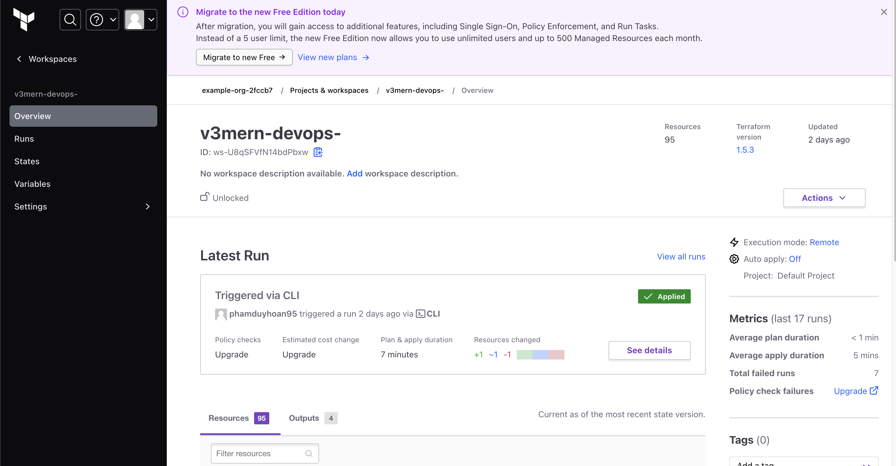

# Fill the information in config.sh

```bash
cp config_example.sh config.sh
terraform init
terraform plan
terraform apply
```
# Help
## Pull the state to terraform.tfstate file
```bash
    terraform state pull >> terraform.tfstate
```

# Login to Kubernetes
```bash
aws eks --region us-east-1 update-kubeconfig --name <the output eks>

```

# Go to ../../k8s folder to setup K8s cluster

# Copy built frontend folders
```bash
cd ../../../frontend/
yarn build
aws s3 cp --recursive build/ s3://<your output S3 bucket>
```

## Output on the Terraform Cloud

